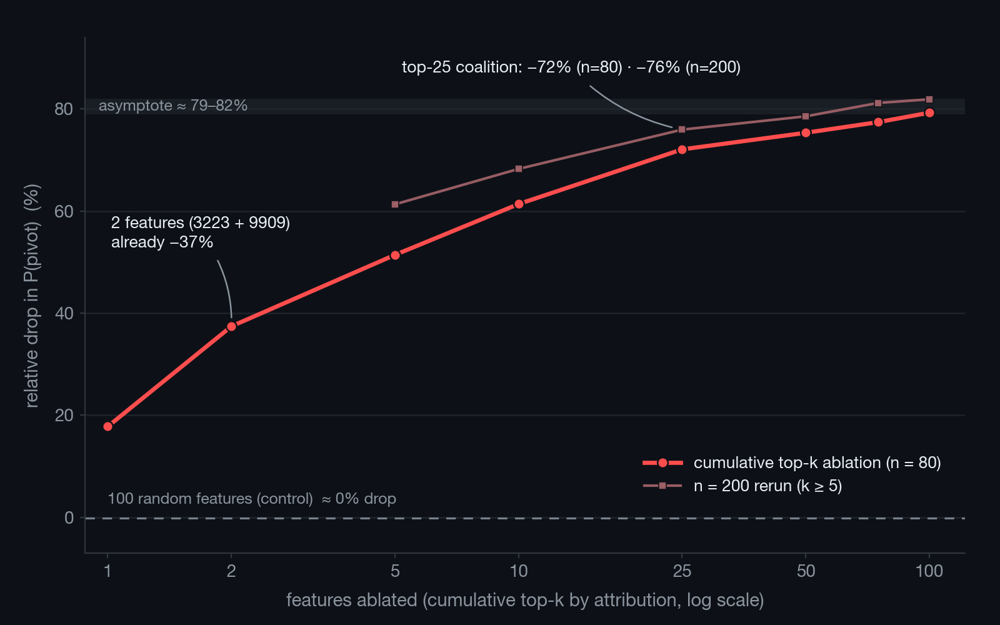
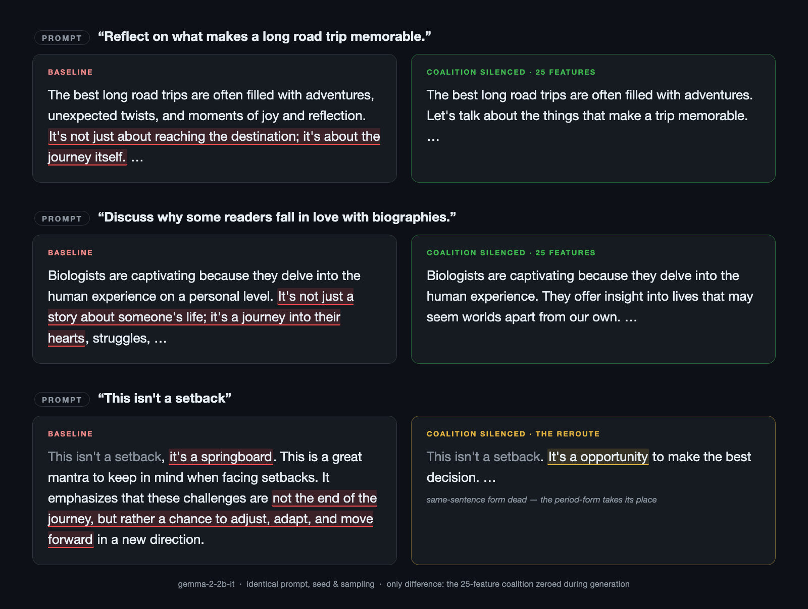
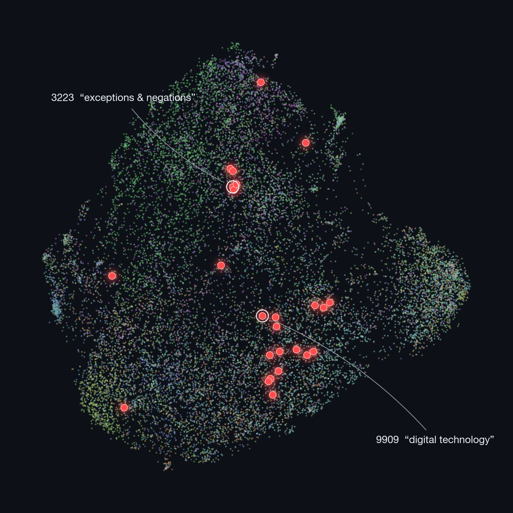

# I Found the Neuron That Makes AI Write Like AI. Then I Tried to Kill It.

*Spoiler: it isn't one neuron. It's twenty-five. And they don't really want to die.*

> **TL;DR** — Every chatbot leans on one sentence shape: *"It's not X, it's Y."* I went looking for the single internal feature in Gemma 2 2B that produces it. There isn't one — there's a **coalition of twenty-five features**, two of which do a third of the work each. Silence all twenty-five and the textbook form of the tic all but vanishes from neutral prompts (**−93%**), and the prose stays fluent. But the model is a Hydra: it reroutes into sibling phrasings, an affirmative cousin (*"it's more than just X…"*) that actually gets **stronger**, and escapes only a blinded frontier-model judge can see — count anything antithesis-shaped and the total barely moves. The negated grammar dies; the intention survives. The real discovery is what the coalition turns out to be: the model's **contrast machinery** — and the lesson is that you can't delete a habit by deleting its grammar; the model re-expresses the intention through whatever grammar you leave it. Code, receipts, and an interactive demo are linked at the end.

---

There's a sentence I want you to read out loud.

> "This isn't a setback, it's a springboard."

You know that sentence. You've read it five hundred times this year. You couldn't pick the chatbot that wrote it out of a lineup of chatbots, because every chatbot writes that sentence. Different topic, same shape. *It isn't X — it's Y.* I'll call it the **AI-ism** for the rest of this piece, because that's what it is. The bot's tic. The deep tell.

I wanted to know if I could turn it off.

Not from the prompt side — that's been tried. You can ask the model not to do it; the model nods, then does it three sentences later. You can ban the word "just" from its vocabulary; the model finds a comma, finds an em-dash, finds another verb. The construction is too useful to the model. It is, on the inside of the model's head, doing something.

What I wanted to know is what that *something* was, and whether you could reach inside the model — open it up like a clock — and switch the something off. Most of the work in mechanistic interpretability looks for the *one feature* that runs a behaviour. Refusal, for instance, turned out to live in one direction in the residual stream of every model anyone's checked. Erase that direction, the model stops refusing to write your stalker fanfic. The literature kept publishing variants on this: *a single feature mediates X*, *one direction is the locus of Y*.

I bet the AI-ism would be the same. I spent a weekend being wrong about that.

---

## A digression into 1753

The construction isn't a chatbot invention. It's a 2,800-year-old rhetorical move.

In 1741 the Oxford Professor of Poetry, a 31-year-old clergyman named Robert Lowth, started a series of Latin lectures on the literary structure of biblical Hebrew. Published in 1753 as *Praelectiones de sacra poesi Hebraeorum*. He gave the move a name: **antithetic parallelism**. Two clauses, structurally mirrored, one denied and one affirmed. *"A wise son brings joy to his father, but a foolish son grief to his mother."* The book of Proverbs is composed almost entirely of it. Hebrew poetry uses it as a beat.

Modern chatbots front-load the negation — *"it's not X, it's Y"* instead of *"the wise A, but the foolish B"* — but it's the same engine. Lowth was looking at it three millennia after it was invented. The chatbot has only had it for two years.

Which means: the move itself is fine. It's an old beat. The thing that's wrong is the *over-application* — every chatbot reaches for it on every prompt, regardless of whether the antithesis actually clarifies anything. Half of LinkedIn caption advice in 2026 is just "stop doing this." So: can we reach into the chatbot and remove its eagerness to do the antithetic parallelism move, while leaving the rest of the chatbot intact?

That's a question with a real answer, if you have the right tools. I went looking.

---

## The setup, in plain English

I'll move fast because the punchline is more interesting than the apparatus.

**The model.** Google's Gemma 2 2B — an open instruction-tuned model, two billion parameters, runs on a laptop. Small enough to probe directly, big enough to produce fluent prose. It produces the AI-ism or its nearest cousin in about one of every eleven answers to neutral open-ended prompts — within just the first fifty tokens — which sounds low until you realise that across a day of chatbot reading, that's one in every other paragraph you skim.

**The microscope.** The way you look inside a model these days is a **sparse autoencoder** — an SAE. It's a little learned dictionary. You feed it the model's internal state at a given layer and it decomposes that state into a sum of 16,384 *features*, of which only a handful are firing at any given moment. The clever part: each feature gets an automatic English-language label. Feature 3223 in this model is labelled *"phrases conveying exceptions or negations."* Feature 9909 is *"references to digital technology and online interactions."* Feature 10678 (a different layer) is *"phrases related to careful planning."* That kind of thing. The labels come from another model that reads the example sentences each feature fires on and writes a summary. They're noisy but mostly truthful.

**The substrate.** I keep all 16,384 features in a Neo4j graph as nodes. Edges between them encode three structural relationships: which features write similar things to the model's scratchpad (decoder cosine, 524k edges), which features fire together (co-activation, 272k edges), and which automatically-discovered cluster they belong to (Leiden community detection, 18 communities). I'll come back to this — it's the navigational instrument that turns a flat 16k-feature list into a queryable map of meanings. Without it you can't reason about features by hand.

**The probe.** Take a sentence the model is *about to* commit to the AI-ism with — something like *"It's not a tool"*. Truncate it right before the model picks the next word. Look at the probability the model assigns to any of the comma-and-pivot words that complete the construction (*", but"*, *", it's"*, *"—"*). Call that probability **P(pivot)**. Across 80 such truncated prompts, P(pivot) at baseline is about 0.28. That's the thing I'm going to try to push down.

If I can find the feature, or features, that drives P(pivot), and disable them, the construction should stop. That's the bet.

---

## The naive attack

I did what anyone would do. I ranked all 16,384 features by how much zeroing them out drops P(pivot). The winner, by a wide margin, was **feature 3223**. Label: *phrases conveying exceptions or negations.* You can imagine my satisfaction. The literal negation feature. Cinematic.

I zeroed it. P(pivot) dropped by 18%. Real drop, beat every random baseline.

So I went for the kill. I took feature 3223's direction in the model's internal vector space and *projected it out of every layer* — the Arditi et al. 2024 method, the one that erased refusal behaviour from a dozen chat models. It was supposed to make the construction structurally impossible. Cannot be represented. The model literally cannot write notes along that axis.

I ran the test. The first generation, on a prompt about an Antarctic research station, started:

> *"Imagine a world, **not of green meadows and warm breezes, but of endless white**, the sun a distant memory…"*

The intervention designed to make the construction *impossible* opened with the construction. Inside a model whose residual stream had been continuously stripped of feature 3223's direction. Ninety generations per arm later, the score was: fifteen of ninety baseline generations contained the construction; twelve of ninety still did under the kill. The most theoretically principled attack in the playbook had shaved off a fifth.

I ran a gauntlet of seven attacks in total, and the scoreboard is the finding ([receipt](./gauntlet_union_rescore.json)). Asking nicely in the system prompt cut the construction by about forty percent — the model nods, then does it anyway. Banning the pivot words outright at the logit layer (*but*, *just*, *only*, *rather*, *more*, *less*, the em-dash) killed it completely — by making seven of English's most common words unsayable everywhere. That's not removing the habit; that's sewing the mouth shut. Showing the model four de-slopped exemplars in the prompt also killed it completely — by making the model imitate the exemplars' clipped register wholesale; the cure worked by replacing the model's voice. (If you only need a practical takeaway for your own prompting, it's hiding here: few-shot exemplars beat instructions, and both have side effects.) The two feature-scalpel attacks — ablate 3223 only when it fires, ablate it everywhere — did the partial thing: the textbook form went away, adjacent forms went up, net minus a quarter. And the learned steering vector (the CAA recipe) only killed the construction at a coefficient where the prose collapses into *"the cold, the cold, the cold, the cold"* repeated to the token limit.

That's the pattern: prompt- and logit-level attacks "work" only by collateral — muzzle the vocabulary, replace the voice, or lobotomize the prose. Mechanism-level attacks on *one feature* leave the behaviour standing. The model wasn't being killed. The model was *rerouting*.

There's a name for this. It's called the **Hydra Effect** — Anthropic and DeepMind have been writing about it for two years. Knock out one path that produces a behaviour, another path compensates. The Hydra grows another head. Most of the published cases are about factual recall: ablate the neuron that remembers Paris is the capital of France, the model finds another way to say Paris. I'd never seen it called out for a rhetorical behaviour, but here it was. The model was being a Hydra about contrastive correction.

Which means feature 3223 wasn't really *the* feature. It was *a* feature. There were others. I just hadn't found them.

---

## The realization

Here's the structural lesson I should have started with.

The published refusal-direction work showed that one direction in the residual stream mediates refusal. That's a beautiful clean result. It made everyone in interp assume *most* behaviours work like that. *Necessary and sufficient.* One thing.

But there's no reason that has to be true. A behaviour can be *necessary* in one feature and *not sufficient* — the model needs the feature, *and* the model has other ways of getting the same effect when the feature isn't available. The cleanest evidence for this is when you turn off the feature and the behaviour drops a little but not to zero. That's what 3223 looks like.

The model is, in some sense, hedging. The construction is implemented redundantly. A coalition of features cooperates to produce it, and the coalition is robust to losing any one member.

If that's the case, the right attack isn't to find a smarter way to disable one feature. The right attack is to find *the rest of the coalition* and disable all of them at once.

This is where the graph stopped being decorative.

---

## The eighth attack

I needed to find the coalition. The honest version of that question is: which features, in addition to 3223, have a large causal contribution to P(pivot)?

I ran the same per-feature attribution scan but this time kept the top hundred, not just the top one. The top three: feature 3223 (negation), feature 9909 (digital technology), feature 12898 (societal issues / laws / marginalised groups). The next twenty-two: a heterogeneous cloud of features about concern, accountability, scientific measurement, urgency, ethics, professional roles. Not what you'd guess. Not all about negation. Topical scaffolding.

Then I ablated them in joint-set ladders — top-2, top-5, top-10, top-25, top-50, top-75, top-100 — and measured P(pivot) at each rung.

| set size | P(pivot) | drop from baseline | rel drop |
|---:|---:|---:|---:|
| 1 (just 3223) | 0.228 | −0.050 | **−18%** |
| 2 | 0.174 | −0.104 | **−37%** |
| 5 | 0.135 | −0.143 | **−51%** |
| 10 | 0.107 | −0.170 | **−61%** |
| 25 | 0.078 | −0.200 | **−72%** |
| 50 | 0.068 | −0.209 | −75% |
| 100 | 0.058 | −0.220 | −79% |

*(Rows 1–10 from [`joint_ablation.json`](./joint_ablation.json), rows 25–100 from [`asymptote_ladder.json`](./asymptote_ladder.json); same 80 truncated prompts, same baseline 0.278.)*


*The ladder. Two features already buy a 37% drop; the curve asymptotes around 79–82%. Ablating 100 random features (dashed line) does nothing.*

There's the coalition. The first five features get you to 51%. The first ten get you to 61%. By twenty-five you've taken away 72% of the model's commitment to the construction at the decision point. By a hundred you asymptote at about 79%. After that the SAE basis at this layer has nothing more to give you — the remaining 21% lives at later layers or in the SAE's reconstruction error (I'll get to that). I also ran this exact ladder at higher power (200 D1 prompts instead of 80) and the asymptote sharpened slightly — top-25 = 76% drop, top-100 = 82% drop. Same shape, tighter numbers. [Reproducible run.](./asymptote_ladder_n200.json)

The control: ablating a hundred *random* features moves P(pivot) by under 0.001. The 79% drop isn't an artefact of mass ablation. It's specific to this set.

The model wasn't being a Hydra against the coalition. It was being a Hydra against my attempts to find one node of the coalition at a time. Hit it from all twenty-five directions simultaneously and it loses three-quarters of its grip.

---

## In actual prose, on actual prompts

The number above is at one token position. The interesting question is whether the kill survives in actual generation — does the model, allowed to write a full paragraph with the coalition silenced at every token, produce the construction less often?

Up front, a confession that turned into the finding itself. An earlier draft of this post said "80% drop, p < 10⁻⁶." Then, while hardening the piece, I audited my own detector and the number started falling — not because the experiment changed, but because every time I sharpened the ruler, I caught the model escaping somewhere new. The first version of the detector counted ordinary concessives (*"running is a wonderful activity, but…"*) as AI-isms, inflating the baseline. Fixed. It was also blind to the cross-sentence form (*"isn't X. It's Y"*) — the single most common shape the silenced model escapes into. Fixed; the survivors doubled. Then I found a third escape route the detector had no name for at all. Every revision, with every dropped and added detection, is hand-inspectable in the [audit](./permissive_fix_audit.md); I'm leading with this because the alternative — you finding it — is worse.

So here is the result, on the test that matters: 102 open-ended prompts a real chatbot user might actually send (*"describe a hospital cafeteria at 2 a.m.", "discuss the role of mentorship"*), three seeds each, 306 paired generations, none of which played any part in selecting the coalition. I'll give you the answer as **three nets, narrowest to widest**, because "did it work?" honestly depends on how wide you cast the net.

**Net 1 — the textbook sentence.** The strict, blind-validated classifier (precision 0.80, recall 1.00 on 90 sentences it had never seen) catches the canonical single-sentence form — *"isn't X, it's Y"*. Baseline: 14 of 306 generations. Coalition silenced: **1**. A **93% drop**. The sentence everyone recognises as the AI-ism is, to the precision of this experiment, gone.

**Net 2 — the whole negated family.** Add every variant that *denies one thing and substitutes another*: the cross-sentence form, the do-support forms (*"doesn't just X, it Y"*), looser punctuation. This is the construction family as the project registered it. Baseline: 18 of 306. Silenced: **10**. A **44% drop** — if the features did nothing, a split this lopsided comes up by luck about once in 85 runs (McNemar mid-p = 0.012; 95% CI on the drop: 14% to 70%). The check a layperson can do by eye: collapse the seeds and ask which *prompts* changed. Nine changed; **eight of the nine got cleaner**, one got worse (sign-test p ≈ 0.02). Real, but half the size of Net 1 — the model reroutes into the period-form, which the coalition only partially covers.

**Net 3 — the family plus its cousin.** The third escape route: drop the negation entirely. *"A library is more than just a building. It's a community."* Same rhetorical melody, nothing denied. This affirmative minimizer was never in the registered construction family — it isn't a correction, so I keep it out of the family and count it separately rather than quietly fold it in. Counted separately, it tells you exactly what the model did: the cousin **went up** under the kill (10 baseline → 11 silenced). Cast a wider net — family plus cousin, anything regex can see that smells like the tic — and the drop is **28 → 21, about 25%**.

**Net 4 — a judge with no regex at all.** After all of the above I stopped trusting my own nets, so I hired an outside one: Claude Opus, judging every generation from all three evals — 1,452 texts, blinded to condition, shuffled into random order, one at a time, required to quote the exact span it convicts on ([harness](../scripts/llm_judge_rescore.py) · [report](./llm_judge_rescore.md)). Two things came back. First, validation: the judge agrees with my family detector on **88–92%** of generations, so the regex tiers measure what they claim to measure. Second, the sharpest version of the reroute: told to count *anything* antithesis-shaped — any denial-and-substitution, however phrased — the judge finds the neutral-prompt total **nearly unchanged: 37 baseline → 34 silenced, −8%, not significant.** It catches escapes no regex of mine could see: *"finding a mentor is a journey, not a destination"*, *"she writes with her heart and not with her words"*, *"it goes beyond the mere feeling of accomplishment."* On the primed prompts, where the prefix has already committed the model to the negated form, the same judge confirms the kill at full strength (**−48%, p ≈ 5 × 10⁻⁴**).

There's the finding, stated honestly, all four nets at once. **Silence the coalition and the model almost completely stops *writing the negated grammar* — and the rhetorical intention survives, re-expressed through whatever grammar is left.** The Hydra doesn't die; it changes heads — comma-form to period-form to affirmative cousin to phrasings only a frontier-model judge can spot. What died, measurably and near-totally, is the specific syntax the coalition was selected to control. It's also why the mechanism numbers earlier in this piece (−72% at the decision point) are bigger than these prose numbers: at the single token where the construction commits, the machinery really is gone; over fifty free tokens, the *intention* finds other machinery.

**Primed prompts make the same point from the other side.** Hand the model a prefix that's already committed to the construction — *"It's not a tool"*, *"This isn't a setback"* — and score the prefix plus its continuation. At baseline, **89% of 300 continuations** complete or contain the construction (the model takes the bait almost every time). Coalition silenced: **40%**. The textbook completion specifically collapses from 57% to 10% (−82%). Caveat stated plainly: 40 of these 100 prefixes are the very prompts the coalition was selected on — but on the 60 prefixes that played no part in selection, the drop is the same, so contamination isn't carrying the result. ([Held-out re-slices.](./heldout_reslice.md))

**And the two-feature core gets requalified.** Earlier I showed two features (3223 + 9909) buy a 37% drop at the decision point, and the leave-one-out says they're the only indispensable members. So can two features replace twenty-five? At the single token: largely yes. Over a sustained paragraph: no. Ablating just the two cores on the primed set cuts prefix-completion by only **15%**, against the full coalition's 55%. **Two features carry the decision; it takes twenty-five to carry the paragraph.** The twenty-three "redundant" supporters aren't cleanup — they're what keeps the kill killed while the model writes.


*Same prompt, same random seed, with and without the twenty-five features. Top two: clean kills — the move never forms. Bottom: the reroute.*

Two generations show the whole story. The clean kill: a baseline answer about what makes road trips memorable opens *"It's not just about reaching the destination…"*; silenced, the same prompt and seed produce a plain, fluent paragraph about adventures that never reaches for the move. And the reroute: *"This isn't a setback"* completes, at baseline, with the immortal *"…it's a springboard."* Silenced, the same seed produces *"…It's a opportunity to make the best decision."* Look closely: the same-sentence form died — and the period-form took its place, minus an article. That single pair of generations is the Hydra Effect rendered in ten words.

---

## What the kill actually removes

Here's the most skeptical reading of everything above, and I'd rather write it than receive it. The coalition was selected for its causal effect on P(pivot) — and the pivot token set includes the comma, *" but"*, *" it"*, and the dash. So: did I remove a rhetorical habit, or did I suppress comma-and-but syntax wholesale, with the construction dying as collateral damage?

Measured rather than argued ([collateral table](./collateral_syntax.md)): on the neutral prompts, the share of generations containing the word *"but"* anywhere falls from 13.4% to 1.3%. Commas fall from 1.5 to 0.6 per generation. On the primed prompts — prefixes that practically beg for a contrast — *"but"* falls from 75% of generations to under 2%. Meanwhile: words per generation identical (32 → 32), sentence counts identical, em-dashes basically unmoved, and perplexity on held-out human prose at 1.08× baseline. The model writes just as much, just as fluently. It writes *around* the contrast.

So the honest name for what these twenty-five features control is not "the AI-ism." It's the model's **contrastive-syntax machinery** — its commitment to pivoting a clause against the previous one. The AI-ism is that machinery's most visible product, and it dies when the machinery dies. What this intervention gives you is *contrast-mode control*, with the construction as its loudest casualty. Whether that's a de-slop scalpel or a blunter instrument depends on whether you wanted the model to keep its "but"s. For the chatbot-tic use case — the model that contradicts itself into profundity five times a page — you mostly didn't.

---

## What the coalition actually looks like

I ran a leave-one-out from the top-25: for each feature, I ablated *the other twenty-four* and measured how much the drop fell. That tells you which features are individually indispensable (removing them costs a lot) versus individually substitutable (removing them costs almost nothing because the rest cover for them).

The result is the cleanest structural thing I found in this project. Two features stick out:

- **Feature 3223**, *phrases conveying exceptions or negations.* Cost when removed: 0.073.
- **Feature 9909**, *references to digital technology and online interactions.* Cost when removed: 0.074.

Then there's a secondary tier, mostly **feature 12898** (*references to societal issues, particularly laws and marginalised groups*) at 0.021. And then twenty-two features whose individual cost is under 0.013. Remove any one of them in isolation and the coalition barely notices.

So the coalition has a structure: **two indispensable core features doing about a third of the work each, and a long tail of twenty-two redundant supporters**. The reason the single-feature attacks all failed isn't that the construction is uncuttable — it's that they were all hitting one node of a coalition that has twenty-five.


*The 16,384 features of the layer-20 SAE, coloured by community. The twenty-five coalition features in red — the two cores labelled. Note how the coalition scatters across the map instead of clustering: that's the next section's finding.*

I tested whether extending the analysis past rank 25 changes the picture — leave-one-out from the top *fifty* features instead of the top twenty-five. The result is even cleaner than the top-25: the same two indispensables (3223 + 9909 at ~0.07 each), the same one secondary (12898 at 0.020), one more at 0.012, and then *all forty-three remaining features have cost-when-removed below 0.005 — every feature ranked 26–50 sits below 0.0012*. There's no second indispensable tier hiding past rank 25. The coalition really is two-cored.

The labels are the second surprise. I expected the coalition to be a cluster of "negation" features. It isn't. 3223 is about negation. 9909 is about digital tech. 12898 is about laws and marginalised groups. The remaining features are about concern, accountability, ethics, scientific measurement, urgency, professional roles. *They look topical, not syntactic.*

What I think is going on: the construction commits when the negation feature plus the *situational scaffolding around it* is active. Contrastive correction lands when there's a thing to *care about* — a problem, a stake, a domain in which the contrast carries rhetorical weight. The negation feature alone is just negation; combine it with "this is a serious topic about which a corrective claim might matter" and you get *it's not X, it's Y*. The coalition isn't a syntactic engine; it's a *rhetorical context* detector.

If that sounds like it contradicts the "contrast machinery" framing from two sections ago, it doesn't — they're trigger and effect. The topical features detect *when* a corrective contrast would land; what they jointly drive is the syntactic *commitment* to it — the comma, the pivot, the "but". Kill the detector and the commitment never fires, which is why the collateral table shows the syntax dying alongside the construction.

I don't have a clean proof of that interpretation, but the labels point exactly there.

---

## The first surprise: the graph guessed wrong

I want to dwell on the graph for a second, because it's the part that earned its place by being wrong before it was right.

The hypothesis the graph naturally generates is *structural*: features that are like 3223 are probably in the coalition with it. There are three obvious structural priors. The graph holds all three as queryable edges:

- **Decoder neighbours**: features that write similar patterns to the residual stream (cosine of their decoder columns).
- **Co-activators**: features that fire together across the corpus (PMI, Jaccard overlap).
- **Community-mates**: features in the same Leiden cluster.

So I tried each. Three Cypher queries. Three measurements. Then ladder probes on each set.

| prior | size | P(pivot) drop |
|---|---:|---:|
| 3223 alone | 1 | −18% |
| 3223 + 9 decoder neighbours | 10 | −20% |
| 3223 + 9 co-activators | 10 | −18% |
| Top 10 of 3223's community | 10 | **−0.1%** |
| Causal attribution top-10 | 10 | **−61%** |

*(The community row was a quick probe at 10 prompts; the rest are full n=80 runs — [`joint_ablation.json`](./joint_ablation.json), [`probes_log.md`](./probes_log.md).)*

All three structural priors *failed*. The decoder neighbours added about two percentage points beyond what 3223 alone did. The co-activators added literally nothing. The community-mates — the top features in the Leiden cluster containing 3223 — moved P(pivot) by under one part per thousand. The features that *implement* the construction with 3223 aren't its decoder neighbours, aren't its frequent firing partners, and aren't its community-mates.

The only prior that worked was the direct causal one: *which feature, when removed, drops P(pivot) most?* And then take the top N of those.

This is the graph contributing a negative result, and that's a real contribution. The graph let me ask three structurally-motivated hypotheses in an afternoon, fail at each, and move on. Without the graph that finding would have taken three custom scripts, three measurement runs, and three writeups. With the graph it took half an afternoon.

The graph's productive role in this project, in retrospect, is:

1. **It made the negative result cheap.** I learned that structural similarity in this SAE doesn't predict causal coalition membership. That's useful to know — it generalises beyond this construction.
2. **It made the coalition legible.** Once I had the twenty-five feature indices, the graph turned them into a list of labelled, communitied, density-annotated, hover-able dots in a map. Without that, the coalition is twenty-five integers.
3. **It made the demo possible.** The playground I built lets you type a concept ("negation", "punctuation", "names") into a box and the graph instantly highlights every feature whose label matches. You can silence them with one click. The "type a meaning, kill it" gesture is the magic moment of the demo, and it's a Cypher query and a label-similarity match away from impossible.

A flat sixteen-thousand-feature list is not navigable. The graph turns it into a map. The model performs the interventions; the graph chooses the targets and gives them names. That's the role.

---

## The second surprise: it really is at one layer

Gemma 2 2B has twenty-six layers. The work above is all at layer 20. The natural follow-up is: is layer 20 special, or does the construction live everywhere?

I re-ran the whole pipeline — per-feature causal attribution, plus the ablation ladder — at layer 12 (early-middle) and layer 25 (late). Each layer with its own top-25 features. Different SAEs, different feature numberings, different coalitions.

| layer | baseline P(pivot) | after top-25 ablation | relative drop |
|---:|---:|---:|---:|
| L12 | 0.288 | 0.202 | −30% |
| **L20** | **0.278** | **0.077** | **−72%** |
| L25 | 0.219 | 0.104 | −52% |

L12 is *"the construction isn't built here yet"*. The early layer represents enough of the prompt's topical context that some features correlate with the pivot, but the machinery that *commits* to the construction hasn't run.

L25 is more interesting. It has a real coalition (52% drop), but its baseline is lower because inserting the L25 SAE itself loses 19% of P(pivot). The late-layer SAE basis is genuinely too narrow for the construction — what it reconstructs faithfully isn't quite the right thing. Some construction-relevant signal lives in the SAE's *error term* at L25.

And the kicker, the bit that nails the locality finding: I joint-ablated **L12 + L20 + L25 top-25 simultaneously** — seventy-five features across three layers — and the absolute floor was 0.079. Same as L20-alone's 0.077. The late-layer coalition isn't an independent implementation. It's the same mechanism, observed from downstream. There's one place to intervene on the construction, and it's layer 20.

The Hydra has heads at multiple layers, but it has one heart.

---

## What I think this means

I'll be honest about the scope. This is one construction in one open-source model, with one SAE family at one layer. I have not shown this generalises to Llama or Mistral; I haven't shown that *other* rhetorical behaviours in this model have similarly small coalitions. The work I've done here is an existence proof: at least *this* behaviour, in *this* model, is implementable as a small, identifiable, coalition that you can disable.

The published interpretability literature's flagship results are behaviours that live in one direction. Refusal famously does; sycophancy and honesty have been argued to. Single directions. Single switches.

I expected the AI-ism to be the same. What I found is that even when one feature is genuinely the right anchor — feature 3223 is exactly what you'd want the negation feature to be — the behaviour the feature anchors can still be a coalition. The model can run the construction without using the feature, because the model has twenty-two redundant supporters. Single-feature attacks failed not because they were wrong about the feature but because they were wrong about the architecture: behaviours have coalition addresses, not switch addresses, and the prior you need to find the coalition is causal, not structural.

The coalition's membership is honest about its own fuzziness, too. Re-run the selection with a hundred prompts instead of forty and nineteen of the twenty-five members stay, including the same top three. The cores are stable; the tail is fungible — which is exactly what the leave-one-out said from the other direction. ([n=40](./pivot_attribution_n40.json) vs [n=100](./pivot_attribution_n100.json).)

The good news is that twenty-five features is not a lot. The coalition is small enough to enumerate, identify by label, and silence. The bad news, for anyone who wants to *positively control* the model — make it produce the construction reliably by turning the coalition up — is that I tried clamping the coalition to high values and it doesn't reproduce the construction. *Necessity yes, sufficiency no.* You can take the construction away. You can't put it back the same way.

That asymmetry is the deepest thing in this writeup, and I don't fully understand it.

---

## Where I could be wrong

I want to be specific about this, because a friend with mech-interp credentials read an early draft and pointed at four things — and the process of answering them produced half the receipts in this piece, including the detector fix above. Here is the full hostile read, pre-empted.

**This is post-hoc.** The project's pre-registration committed to single-feature attacks, which is what the original gauntlet ran. The coalition is the finding that came *out* of those attacks failing — and between the gauntlet, the discovery campaign, the structural priors, three layers, the ladders and the leave-one-outs, this project ran on the order of fifty analyses before the headline number existed. Nothing here is a pre-registered confirmation; what protects the result is effect size, the out-of-sample neutral-prompt eval, and the matched-activation null. That null is the control that actually matters: twenty independent draws, each ablating 25 non-coalition features matched to the coalition's activation density (0.0158 vs 0.0158): the coalition's P(pivot) drop was +0.200; the largest of the twenty null drops was +0.001; the mean was *slightly negative*. **The coalition beats all twenty draws by two hundred times the best null's margin.** ([Reproducible run](./matched_activation_null.json).) One honesty note on it: the pre-registration spec'd matching on per-position activation, and the implementation matches on corpus-wide density — a position-matched rerun is still owed. So are the other pre-registered controls: specificity on adversarial negation sets, and interchange patching for sufficiency.

**Several of the supporting numbers are in-sample, and I've labelled which.** The mechanism-level numbers — the ladder, the leave-one-out, the matched null, the cross-layer test — are all measured on the same 80 truncated prompts the attribution scan used. The neutral-prompt behavioural eval (the three nets) is the out-of-sample one: those 102 prompts never touched selection. The primed eval is 40% in-sample, but its held-out half shows the same drop (50% vs 51%). The two-feature demo number is fully in-sample. And my own protocol's reserved 26-prompt confirmation slice is underpowered on its own — seven baseline events, a non-significant 29% union drop, though even there the strict form goes 5 → 0. A properly pre-registered confirmation run on fresh prompts is the single most important experiment this project hasn't done. ([Re-slices.](./heldout_reslice.md))

**Sufficiency is still asymmetric and I haven't fully retried it.** Clamping the coalition's activations to high values doesn't reliably *produce* the construction in cases where the model wouldn't have used it. The pre-registration committed to one method of sufficiency retrial — interchange patching from a construction-bearing source — and that hasn't been done yet either. The honest reading is that necessity is clean and sufficiency is murky; the murkiness may be a real fact about coalitions, or may be a not-yet-run experiment away from resolving.

**One model. One layer family. One width.** Gemma 2 2B, Gemma Scope canonical SAEs at 16k width. The finding is local to this configuration. The cross-model replication that would tighten the claim — does the same shape of coalition exist in Llama 3 or Mistral or Qwen at L20-equivalent layers? — is on the to-do list and isn't done.

**The fluency defence uses the wrong instrument, and I know it.** The 1.08× perplexity number is computed on held-out *human* prose (single-feature ablation: 1.000×, [receipt](./phase5_quality_single_3223.md); full coalition: 1.079×, 1.123× under clamp-up, [receipt](./phase5_quality_coalition_top25.md)) — that tells you the model still *predicts* clean text, not that the text it *writes* stayed good. The right instrument for "did the de-slopped chatbot get worse" is blinded preference judging of its own generations, which I haven't run. The circumstantial evidence is in the collateral table — identical length, identical sentence counts, no degeneration asymmetry — but circumstantial is what it is.

**Three detectors, three validation states — and one definitional boundary I chose.** The strict classifier is the only blind-validated one (P = 0.80, R = 1.00 on 90 independently-sourced sentences, [Tier 0a](./tier_0a_classifier_blind_eval.md)). The permissive layer that completes the family is regex-only: FP-audited against these corpora after the fix ([audit](./permissive_fix_audit.md)) but not separately blind-validated. The gauntlet section's original referee was a third, separate detector validated at P = R = 0.857 on its own hundred-sentence holdout — an earlier draft conflated it with the strict classifier, which is exactly the kind of error this section exists to catch. And the "cousin" call is a judgment I made, not a fact: I kept the affirmative *"more than just"* minimizer outside the construction family because the registered definition is negation-anchored and the blind validation never covered it — but I report it in every receipt ([all five tiers, side by side](./m1_rescore_union.json)), because folding it in quietly would have flattered nothing and hiding it would have flattered everything. A reader who draws the family line differently gets a number between 25% and 93%; the receipts let you draw it yourself. And since this section was first drafted, a fourth instrument weighed in: the blinded frontier-model judge of Net 4 agrees with the family tier on 88–92% of all 1,452 generations, confirms the primed kill at −48% (p ≈ 5 × 10⁻⁴), and finds the widest semantic count on neutral prompts statistically flat — which is simultaneously the detector's validation and the finding's sharpest limit ([report](./llm_judge_rescore.md)).

## The graph as the selection-and-composition layer

The finding above — a coalition of twenty-five features causally implementing a behaviour — is interesting. What I want to convince you of in this section is a different claim: **once you have that coalition stored as a first-class object in a graph, with the rest of the SAE around it, you can do things you genuinely cannot do anywhere else.**

I built three demos into the playground to make this concrete. Each one is a Cypher query under the hood, and each one is impossible without the graph.

### Demo 1 — Surgical de-slop · `concept ∩ behaviour` via set intersection

The full coalition has twenty-five features. But for any given prompt, only a handful of them are *topically* relevant. The graph lets you intersect a prompt's semantic content (via vector search over the 16,384 SAE feature labels) with a named behaviour's feature set — and silence only the overlap.

Type a prompt, click `✨ Surgical de-slop`, and the playground:

1. Embeds your prompt and finds the top-K labels whose meaning matches it
2. Cypher-intersects those features with the `ai-ism` `:Behaviour`'s `INCLUDES` edges
3. Silences only the intersection — a precise subset of the coalition, scoped to your prompt

For *"Discuss the legal and medical implications of AI in healthcare"* the graph returns two: feature 7361 (*statements about legal analysis and recommendations*) and feature 1608 (*legal and health-related terms*). Of the twenty-five-feature coalition, those are the two your prompt actually invokes. Silence them, generate, watch the construction not form.

For *"Explain quantum computing to a child"* it returns zero — the AI-ism coalition isn't topically active for this prompt, so there's nothing to silence. The graph said *leave it alone*. (A vector DB would have happily returned twenty-five irrelevant matches; only a graph with first-class behaviour membership can say "no intersection.")

The Cypher is exposed in the UI (`show Cypher` button):

```cypher
MATCH (b:Behaviour {name: 'ai-ism'})-[r:INCLUDES]->(f:SAEFeature)
  WHERE f.index IN $retrieved AND f.sae_id CONTAINS 'L20/16k'
RETURN f.index AS idx, r.weight AS weight, r.rank AS rank
ORDER BY r.rank
```

That's RAG-for-activations: retrieval is into the model's *internal* concept space, not into a document corpus. The retrieved objects are *features*, not chunks. You compose them into an intervention rather than into a context window.

### Demo 2 — Mix your own chatbot · weighted Cypher union across named behaviours

The playground has four `:Behaviour` nodes seeded: `ai-ism` (the coalition), `bullets` (bullet-point compulsion), `hedging` (caveats), `formal_register` (academic prose). Each is a 25-feature subgraph, weighted by how much each feature contributes.

The mixer gives you a slider per behaviour, 0-100%. The intensity controls how many of each behaviour's top features get pulled into the union. Drag, click Apply, the model regenerates with the union silenced:

```cypher
UNWIND $intensities AS i
MATCH (b:Behaviour {name: i.name})-[r:INCLUDES]->(f:SAEFeature)
  WITH b, f, r ORDER BY r.rank
  LIMIT toInteger(i.intensity * b.coalition_size / 100)
RETURN DISTINCT f.index AS idx, collect(b.name) AS sources
```

`{ai-ism: 100, bullets: 50, hedging: 30}` composes a 45-feature silence-set drawn from three behaviours at proportional depth. The same query mechanism could mix `personality_anxious`, `tone_dry`, `register_clinical` — behaviours are user-defined, named, persistent, composable. **Style as a graph algebra.**

This is the closest thing I've seen to a "model personality control plane" that's actually mechanistic — not a system prompt, not a fine-tune, not RLHF. Sliders that compose subgraphs that drive interventions on running activations.

### Demo 3 — Audit trail · feature provenance as graph paths

Every time the model generates, the playground writes an `:Intervention` node to the graph with `:USED_SOURCE` edges to the things that selected each silenced feature — `preset:top25`, `surgical_deslop:<prompt>`, `community_click:<region>`, `user_click`, `lasso`, `search:<query>`. Each source is in turn `:SELECTED` → `:SAEFeature` for the features it pulled in.

So you can ask, weeks later: *"Why did this run silence feature 3223?"* Answer: a `MATCH (i:Intervention {id: 'i_abc'})-[:USED_SOURCE]->(s)-[:SELECTED]->(f:SAEFeature {index: 3223})` returns the source nodes. **Reproducibility is a path query.**

```cypher
MATCH (i:Intervention {id: $iid})-[:USED_SOURCE]->(s:Source)-[:SELECTED]->(f:SAEFeature)
  OPTIONAL MATCH (f)-[:LABELED_AS {primary:true}]->(l:AutoInterpLabel)
RETURN s.kind, s.label, collect({idx: f.index, label: l.text}) AS features
ORDER BY s.ts
```

The `Why did the model say that?` panel at the bottom of the playground renders this as a source-grouped feature list, with `show Cypher` to expose the underlying query. For glass-box governance — *show me which features your AI silenced, and which lineage decided to silence them* — this is the primitive.

---

### Why this needs a graph

Vector DBs can do retrieval. SQL can do joins. What you can't do without a graph:

- **First-class coalition membership** — *"these twenty-five features collectively implement that behaviour"* as a queryable node with weighted edges. Demo 1's intersection wouldn't work — there's nothing to intersect retrieval *with*.
- **Composable behaviour subgraphs** — Demo 2's union is one Cypher query over arbitrary named coalitions. Without typed edges between behaviours and features, you'd be rebuilding the union in application code per request.
- **Lineage as paths** — Demo 3's audit isn't a join, it's a *traversal* across `(intervention) → (source) → (feature) → (label) → (community)`. Path queries are what graphs are for.

Each demo is one Cypher query of fewer than twelve lines. The graph isn't the visualisation layer; it's the substrate.

## Try it

**The story demo** (hosted, nothing to install — link in the [repo README](https://github.com/ho3h/not-this-but-that)) is an interactive version of what you just read: side-by-side baseline-vs-ablated playbacks you can click through, token by token, with the construction highlighted as it forms — or doesn't. There's also a **slop-o-meter**: paste your own prose and see exactly what the detector in this piece sees, plus a thirty-second spot-the-AI-ism quiz.

**The playground** is the full instrument, and it runs locally (it needs the live model): the three demos above plus everything else — type a concept like "negation" or "code" into the search box and the matching features light up on the 16,384-dot map. Click communities to navigate by meaning. Shift-drag to lasso. Alt-click for graph neighbours. Hover any dot for its auto-interp label. One Python daemon (`scripts/probe_run.sh start`), one local Neo4j for the graph features; setup is in the README.

The code is at [github.com/ho3h/not-this-but-that](https://github.com/ho3h/not-this-but-that). The canonical coalition is pinned: [`pivot_attribution.json`](./pivot_attribution.json) *is* the n=40 selection artifact the daemon serves and every eval used (the n=100 rerun is preserved [separately](./pivot_attribution_n100.json); they overlap 19/25). Every statistic in this piece regenerates from the committed generation JSONs without touching a GPU — `m1_stats_reanalysis.py`, `rescore_union.py`, `heldout_reslice.py`, `collateral_syntax.py`, `audit_permissive_fix.py` in `scripts/`. The generation runs themselves need the model and the seeds in each artifact's config block.

---

## A short footnote on what's where

If you want to know exactly what each tool did:

The **model** is Google's `gemma-2-2b-it`, fp16, Apple Silicon MPS. The **SAE** is Gemma Scope `layer_20/width_16k/canonical`, a JumpReLU SAE trained by Google DeepMind. Every baseline in every comparison runs **with the SAE spliced in** (empty hooks vs ablation hooks), so the splice cost itself — measured separately at +0.007 on P(pivot) at L20 — is controlled out of every number. The **coalition** is the top-25 by per-feature causal attribution to P(pivot) at 40 truncated D1 prefixes (`scripts/pivot_attribution.py`; pinned artifact above). The **strict classifier** is `src/classifier/detect.py` — regex hinges plus a spaCy dependency check, blind-validated at **P = 0.80, R = 1.00** on 90 independently-sourced sentences ([Tier 0a](./tier_0a_classifier_blind_eval.md)), above the pre-registered ≥ 0.70 gate. The family numbers use the **union** of that classifier and the permissive layer in `detect_v2.py` (2026-06-09 negation-mandatory revision, [FP audit](./permissive_fix_audit.md)); the affirmative "more than just" cousin is detected separately (`detect_more_than_just`). The demo's JS detector compiles the same patterns, and [`m1_rescore_union.json`](./m1_rescore_union.json) holds all five tiers — strict, permissive, family, cousin, family+cousin — side by side for all three evals, plus prefix-inclusive scoring for the primed ones. The gauntlet's per-sentence referee is a third detector (P = R = 0.857 on its own holdout, [validation](./gauntlet/g5_referee_validation.md)); gauntlet numbers quoted in this piece were re-scored per-generation with the union ([receipt](./gauntlet_union_rescore.json)). A fourth instrument — a blinded `claude-opus-4-8` judge over every generation, batch-processed with quoted convictions ([receipt](./llm_judge_rescore.json)) — validates the family tier at 88–92% agreement.

The **graph** is Neo4j 5, ingested by `scripts/04_ingest_features.py`: for this model's SAE, 16,384 `:SAEFeature` nodes, **524k** `DECODER_SIMILAR` edges (cosine of decoder columns, kNN-32), **272k** `CO_ACTIVATES_WITH` edges with PMI and Jaccard, 18 Leiden communities, and a `LABELED_AS` edge to an `:AutoInterpLabel` node for every feature with a Neuronpedia label (16,383 of 16,384). The demo's UMAP layout pulls community id and label from the graph for every dot.

The **directional ablation** trick that failed on the AI-ism is from Arditi, Obeso, Syed et al., *Refusal in Language Models Is Mediated by a Single Direction* (NeurIPS 2024) — the same recipe that *worked* clean on refusal. The **CAA** steering-vector method — which kills the construction only at coefficients that collapse the prose — is from Rimsky, Gabrieli, Schubert et al. (ACL 2024). The **Hydra Effect** framing is McGrath, Rahtz, Kramár, Mikulik, Legg (arXiv:2307.15771, 2023), originally about self-repair in attention layers during factual recall. None of those papers had reason to expect their methods would partially fail on a rhetorical behaviour; the partial failure is what made this piece worth writing.

The historical aside on antithetic parallelism is from Robert Lowth's *De sacra poesi Hebraeorum* (1753, English trans. George Gregory 1787). The Proverbs translations are Robert Alter's *The Hebrew Bible* (Norton 2019). Lowth would not have predicted any of this and I think he'd have enjoyed it.
